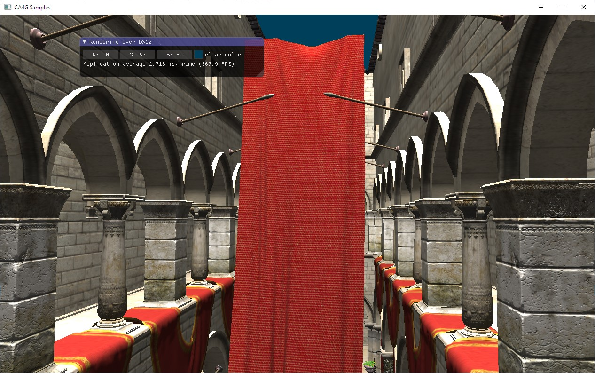
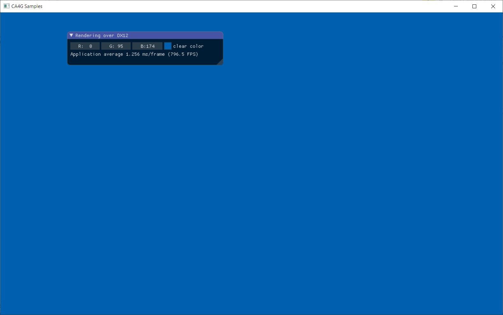
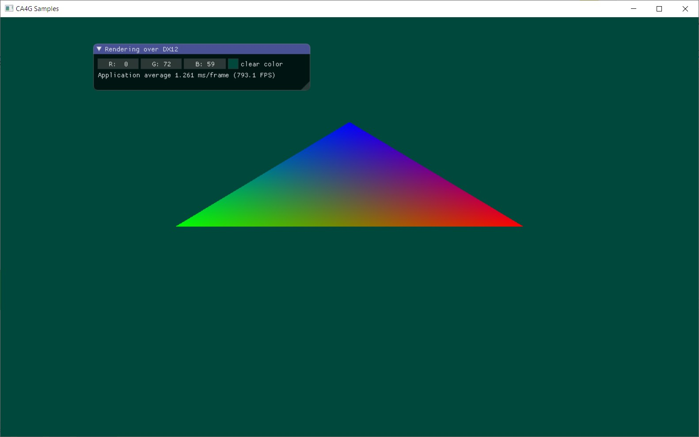

# CA4G Project



The CA4G project allows to abstract to developers from the specific details for driving DX12-based applications. This programming can be bothersome for simple tasks such as resources handling, synchronization, and other graphic-related tasks. This header-only library serves as a façade for accessing to such functionalities and at the same time, uses good practices for DX managing guided using most of the Do’s and Don’ts NVidia advices.

Some of the highlighted features added so far includes:

**Triple buffering support**. CA4G uses a tree Backbuffer swap chain and uses synchronization and allocators to exploit CPU and GPU workloads efficiently.

**Basic synchronization tools**: CA4G hides all proposed DX12 synchronization mechanisms and just exposes a Signal concept. Signals can be trigger by a graphic process and can be waitable for CPU programs to wait for GPU execution. Also, expose functions to flush pending CPU work to the GPU. All resource access barrier are managed by the engine.

**Multi-engine support**: CA4G encapsulates the graphics pipeline usage through Technique concept and execution of process. Processes are methods receiving a command list manager. Depending on the type of the command list (Copying, Compute, Graphics) a different engine is used (Command Queue).

**Multi-threading support**: CA4G device manager has up to 8 threads for command population. All asynchronous processes are queued in producer-consumer queue that deploys process execution across all threads. CA4G exposes functions to flush all pending work to the GPU and wait (on the CPU) for it.

**Typed Resource View**: DX12 unifies resource concept in just one type (`ID3D12Resource`). Nevertheless, CA4G wraps this concept internally and only exposes resource views. Resource views are typed versions of a resource that has the information of the “view” (Descriptors) and other external functionalities for sub-resource managing, slicing, among others. Sub-resources can be treated the same way of resources.

Typed resource view helps in other aspects such as binding, root descriptor construction and static type-check of resource handling.

**Customizable Pipeline state objects**: In CA4G there is a concept Pipeline Bindings with two roles. Representing bindings to the pipeline (resources, constants, samplers, render targets, depth buffers) used to construct the Root Signature object and, in the other hand, manage all settable states to the pipeline exposing functionalities to setup, such as Input Layout, Depth Tests, Rasterizer state, shader stages, etc., used to create the `ID3D12PipelineStateObject`.

## Presenter Class

Presenter object is the "factory" class proposed for rendering through DX12. This class allows to load Techniques, manage triple buffering and other specific tasks for render output presenting.

Use `Load` method to load and initialize a technique, and the use `Present` method to execute the graphic process represented in the technique. Most of the objects defined in CA4G needs to be managed using smart pointers. Pointers to CA4G graphic objects are managed using `gObj<T>` wrapper.

Next code shows a presenter object creation using a handle to the rendered window. Additional parameters may be included for full screen, number of buffers in swap chain and a to indicate if a warp device should be used instead of hardware.

```c++
static gObj<Presenter> presenter = new Presenter(hWnd);
```

​	The graphic loop presenting a specific technique can be as follow:

```c++
static gObj<MyTechnique> technique;

presenter->Load(technique);

MSG msg; // Windows message
ZeroMemory(&msg, sizeof(msg));

while(msg.message != WM_QUIT){
	if (PeekMessage(&msg, NULL, 0U, 0U, PM_REMOVE)){
		TranslateMessage(&msg);
		DispatchMessage(&msg);
		continue;
	}

	presenter->Present(technique);
}
```

## Technique class

A technique is a class representing the developer's usage intention of the DX12 API. The technique has three special methods:

**Constructor**: Use the constructor of a technique to initialize the object with required parameters. Mostly will be used with constants for the technique (will never change). Creational parameters can be passed to the Technique with the additional variadic parameters of `Presenter::Load` method.

**Startup**: This method will be called once the first time the technique is presented. You may use of any DX12 functionality here (even drawing!), but normally will be used to load assets, preprocess scene, populate bundles, and load resource data. Create pipeline objects.

**Frame**: This method will be called every time the technique is presented in a Presenter object. You may use this method to draw in the render target.

Both methods (Startup and Frame) receive the `DeviceManager` object used to execute graphics processes. Any method receiving a `CommandListManager` subclass can be considered as a graphics process. The main role of `Startup` and `Frame` method is the call to execute other methods as graphic process. This is the common usage of `PopulateCommandList` method in other DX12 engines.

Graphics process indicates with the parameter which kind of engine will process the command list. This is the way CA4G supports multiple engines usages. Next code shows a Startup method of a technique using a Copy engine to load some assets and a Compute engine to perform some preprocess computation.

```c++
void LoadAssets (CopyingManager* manager) { ... }

void ComputeSomePreprocessedData(ComputeManager* manager) { ... }

void Startup() {
	perform(LoadAssets);
    perform(ComputeSomePreprocessedData);
}
```
Notice perform macro hides internally the usage of the internal `DeviceManager` accessible from a technique used to enqueue all tasks. To perform this loading stage asynchronously you just need to enqueue the graphic process asynchronously.

```c++
void LoadAssets (CopyingManager* manager) { ... }

void ComputeSomePreprocessedData(ComputeManager* manager) { ... }

void Startup() {
    perform_async(LoadAssets);
    perform_async(ComputeSomePreprocessedData);
}
```

CA4G manages internally a fixed number (defined normally 8) of workers. The main thread host the synchronous worker, and the remain will wait for async tasks to do. This is implemented using a producer consumer queue internally and threads are waiting for new task to be enqueue. That means that every perform_async doesn't represent a new thread is created but that the async process is enqueue for future execution in some engine.

### Synchronizing CPU-GPU work

The proposed mechanism for synchronization in CA4G is the Signal concept. Every time the user use perform_async to enqueue some graphics process asynchronously, this process is enqueued. Using flush method will produce all pending work to be completed (finish populating all pending works in queue) and executed by their respective command queue (engines).​		

```c++
perform_async(LoadAssets);
perform_async(ComputeSomePreprocessedData);
getManager()->Flush(ENGINE_MASK_ALL);
```

There is a macro for such command that can be more easy to read.

```c++
flush_all_to_gpu;
```

Notice that this code means: "I want every pending work for every engine to be sent to the GPU and will wait until that occurs", but that doesn't mean the work was really finished by the GPU. Nevertheless, this command serves as a barrier for different graphic process you want to synchronize on the GPU.

For CPU-GPU synchronization you will need to send a signal through the GPU that will "trigger" an event object in CPU.

For this purpose you may use the `SendSignal` method.

```c++
auto signal = getManager()->SendSignal(ENGINE_MASK_ALL);
```

This method will send a signal through the specific engines and return an object that has all needed values for fencing strategy. Notice you may signal through just one engine and not the others, or through all engines.

Then the CPU can wait for a specific signal object to trigger the event using the `WaitFor` method.

```c++
getManager()->WaitFor(signal);
```

The proposed DSL via macros allows to write this commands in a more readable way. Next code shows a simple combination of previous methods, that waits for the GPU completion of some CPU commanding processes.

```c++
wait_for(signal(flush_all_to_gpu));
```

> All device manager methods for work submission and synchronization must be used only by `Setup` and `Frame` method execution. Never use these methods inside a graphics process method because they are executed by demand and only represents command list populating processes.

## Graphics Processes

All GPU work is considered as a graphics process in CA4G. DX12 unified all work submission to the GPU using Command lists of different engines. The `CommandListManager` class in CA4G is designed for such purpose. This class has several subclasses, one for each different command list type. When a technique calls to perform a graphics process, is really saying "populate a command list with the commands in that method".

The related commands in a graphics command list are grouped depending on the purpose. For instance, all clearing functions are grouped together in a clearing inner object exposed in a command list manager. This is intended for the DSL usage. Next code shows a sample of graphics process that only clears the render target with a specific color.

```c++
void Frame() {
	// Every frame perform a single process using a Graphics Engine
	perform(GraphicProcess);
}

// Graphic Process to clear the render target with a backcolor
void GraphicProcess(GraphicsManager *manager) {
	// render_target macro expands to getManager()->getBackBuffer()
    // returing the current frame render target being rendered.
	manager	gClear RT(render_target, Backcolor);
}
```
Grouping inner objects used are intended for:

**setting**: The function represents a set or binding to the object of some feature. Macro `gSet`. Used for setting states to the pipeline in a `CommandListManager` or settings states to the `PipelineBindings` object.

**clearing**: The function represents a clear action over other objects. Macro `gClear`. Used in a `CommandListManager` object. 

**loading**: The function represents an action of loading an existing object (and initialize). Macro `gLoad`. Used for loading `Technique` objects and `PipelineBindings` objects.

**drawer**: The function represents an action of submitting some draw call. Macro `gDraw`. Used to perform draw calls in a `GraphicsManager` object.

**copying**: The function is intended to copy a buffer from one resource or memory to another. Macro `gCopy`. Used in all `CommandListManager` objects to copy from CPU to GPU and vice versa.

**creating**: The function is intended to create an empty object of a specific type. Macro `gCreate`. Used to create resource objects.

## Resource Management

Despite DX12 proposes an unified resource handling through `ID3D12Resource` interface, in CA4G is used a typed version again. That means that there are several types for each kind of representation a resource may have. For instance, a Buffer, a Texture2D or even a Texture2DMS.

The reason for this is because resource is hidden from developers and all the time the object managed is a `ResourceView`. Resource views hides internally the real resource and exposes functions for querying description of the resource, slicing (gets a range of sub-resources), among others functionalities.

Resources can be created by a `DeviceManager` object. Since technique manage internally a device manager in both, startup and frame methods, a resource can be created any time. Every resource usage is protected via smart pointers using the `gObj<T>` wrapper.

```c++
gObj<Buffer> vertices = nullptr;
...
void Startup(){
	vertices = this->creating->VertexBuffer<VERTEX>(3);
}
```

With the proposed DSL the code below looks like next.

```c++
Buffer* vertices = nullptr;
...
void Startup(){
	vertices = _ gCreate VertexBuffer<VERTEX>(3);
}
```

In order to fill a resource with data, it may be used a `CopyingManager` graphics process. This is the most basic engine proposed in DX12 and in some architectures, submitting work to different engines may represent real parallel work on the GPU.

```c++
void Startup() {
	...	
	// Create a simple vertex buffer for a triangle
	vertices = _ gCreate VertexBuffer<VERTEX>(3);
	// Performs a copying commanding execution for uploading data to resources
	perform(UploadData);
}

// A copy engine can be used to populate buffers using GPU commands.
void UploadData(CopyingManager *manager) {
	// Copies a buffer written using an initializer_list
	manager	gCopy ListData(vertices, {
			VERTEX { float3(0.5, 0, 0), float3(1, 0, 0)},
			VERTEX { float3(-0.5, 0, 0), float3(0, 1, 0)},
			VERTEX { float3(0, 0.5, 0), float3(0, 0, 1)},
		});
}
```
Every resource view manage internally the different descriptors needed for each kind of view. For instance, a `Texture2D` used as a shader resource and then as a render target will cache both descriptors internally.

> This process is hidden from the developer, so you will never need to deal with descriptors, bindings, copying descriptors, descriptor heaps, null descriptors, visible and non-visible descriptor heaps, heaps ring-buffer allocations, resource barriers, resources uploading and readback versions, sub-resources footprints and other DX12 overwhelming stuff. You are very welcome.

### Textures

Texture objects can be created by different ways. First, a normal texture to represent an image.

```c++
manager gLoad FromFile(myTexture, "c:\\Users\\...\\Desktop\\Models\\skybox.dds");
```

This method creates the texture object using the data loaded from an image path. Imaging functionalities of CA4G uses a project published in GitHub. DirectXTex. (link here).

If you need an empty texture you may use:

```c++
auto myTexture = _ gCreate DrawableTexture2D<float4>(512, 512);
```

This texture object is ready for UAV and Render Target purposes. You may indicate how many mipmaps to allocate an the initial state for the internal resource.

Depending on the resource kind, you may access to sub-resources and treat them as resources. Updating data to a resource and sub-resources, binding resources and sub-resources, are treated the same in CA4G.

Imaging you have a texture array created representing a `CubeTexture`. You can use each different cube face texture as a render target in some process.

```c++
for (int i=0; i<6; i++)
{
	gObj<Texture2D> face = myCubeTexture->CreateArraySlice(i);
	RenderFace(i, face, manager);
}			
```

Next sample shows how to populate an array with all sub-resources of a Texture2D.

```c++
// Compute number of subresources
subresourcesCount = Texture->getMipsCount()*Texture->getSlicesCount();
// Array of subresources views
Subresources = new gObj<Texture2D>[subresourcesCount];

int index = 0;
for (int j = 0; j < Texture->getSlicesCount(); j++)
	for (int i = 0; i < Texture->getMipsCount(); i++)
		// Creates a subresource view for each posible array slice and mip slice.
        Subresources[index] = Texture->CreateSubresource(j, i);
```

Texture pixel format can be specified using regular types, vector types (`float2`, `float3`,`float4`, ...) and other types representing color components in an unsigned integer using different distributions, `RGBA` and `ARGB` structs. Scalar types such as `int`, `unsigned int`, `short`, `byte`, ..., are supported as well.

## Pipeline objects and resource bindings

DX proposes a new concept to setup most of the render states required during draw calls and dispatching, the `ID3D12PipelineObjectState`. This object is constructed with all data regarded to states will be set on the GPU to setup the graphics pipeline. That includes shaders, rasterizer states, depth test, stencil tests, input layout description, information about bound render targets, depth buffers, etc.

Other states keep outside pipeline state object, such as viewport, scissor rectangle, vertex buffer and index buffer bindings.

In the other hand, bindings of resources to the GPU for shaders accessibility is done creating descriptor heaps, and copying needed descriptors to that memory, manage a root signature to know how pipeline shaders can access to such resources, and setup the offset of each entry in a root signature to the descriptor heap.

In CA4G there is a class designed to manage everything related to the pipeline object and also includes the binding purpose. So, all the work described below is hidden for the developer.

For CA4G, a `PipelineBindings` object is a generic class that builds a setting object as a mixin of all render state manager object can be set (Notice that depending on the pipeline usage you will require some states or others...). Nevertheless, a common usable version of `PipelineBindings` will be a `GraphicsPipelineBindings` and we will start explaining from it.

### Pipeline Bindings for Graphics purposes

Every draw call needs a pipeline set before with the information about what shaders to set, rasterization options, etc.. You may define such settings in a single typed object inheriting from `GraphicsPipelineBindings`.

This subclass has three methods to override:

**Setup**: This method will be invoked to set all values proposed for each pipeline state. I.e. rasterizer states (cull mode, fill mode). In this method, shaders must be set as well.

**Globals**: This method will be used to collect all global resource bindings proposed for this pipeline. All resources and samplers fields declared as bound in this method will be updated once the pipeline object is set to the pipeline.

**Locals**: This method will be used to collect all local resource bindings proposed for this pipeline. All resources and samplers fields declared as bound in this method will be updated in every draw call to the pipeline.

Next code shows a sample of pipeline bindings implementation.

```c++
struct MyBasicPipeline : public GraphicsPipelineBindings {
    // Render target this pipeline will use
    gObj<Texture2D> renderTarget;
    // Setup method is overriden to load shader codes and set other default settings
    void Setup() {
        // Loads a compiled shader object and set as vertex shader
        auto vsBytecode = LoadByteCode("NoTransforms_VS.cso");
        _ gSet VertexShader(vsBytecode);
        // Loads a compiled shader object and set as pixel shader
        auto psBytecode = LoadByteCode("SimpleColor_PS.cso");
        _ gSet PixelShader(psBytecode);
        // Setting the input layout of the pipeline
        _ gSet InputLayout({
            VertexElement { VertexElementType_Float, 3, "POSITION"},
            VertexElement { VertexElementType_Float, 3, "COLOR"}
        });
    }
    void Globals() {
        // Only one binding when this pipeline state object is set.
        RTV(0, renderTarget);
    }
}
```

> `Globals` and `Locals` are used when the `PipelineBindings` object is initialized internally (loaded in a technique) for collecting field references. Those methods will be only called during initialization and used to create root signature for the pipeline object state. Every time the pipeline object needs to be set or draw call requires for locals, the fields of the object are requested (accessed using a store reference pointer) and bind the real resource.
>
> It is an error to implement such methods using conditionals or loops that can be referring to a value will change after initialization.

For binding use the following methods:

`CBV(slot, &resource, shaderType, space)`: Specifies a constant buffer must be bound to the slot of a specific shader stage.

`SRV(slot, &resource, shaderType, space)`: Specifies a shader resource view must be bound to the slot of a specific shader stage.

`SRV_Array(slot, &resources, &count, shaderType, space)`: Specifies a range of shader resource views of certain length (count) must be bound to the slot of a specific shader stage.

`UAV(...)`: Bounds a resource as an UAV.

`RTV(...)`: Bounds a texture as a render target.

`DSV(...)`: Bounds a texture as depth stencil view.

`Static_SMP(...)`: Bounds a sampler object as a static sampler in the root signature. The sampler object will be queried at initialization so it must be a constant value.

### Building Custom Pipeline State Object

Pipeline state objects are built from small pieces named pipeline subobject states. Each subobject type has a flag indicating the type and the specific value to set after it. DX12 supports a flexible mechanism for building customs pipeline state object designing a struct to describe the stream with all pipeline object setup.

In CA4G this feature is supported using a mixin strategy using inheritance and templates. In fact, the `GraphicsPipelineBindings` object used in the sample below is defined as follows.

> ```c++
> struct GraphicsPipelineBindings : public PipelineBindings <
> 	DebugStateManager,
> 	VertexShaderStageStateManager,
> 	PixelShaderStageStateManager,
> 	DomainShaderStageStateManager,
> 	HullShaderStageStateManager,
> 	GeometryShaderStageStateManager,
> 	StreamOutputStateManager,
> 	BlendingStateManager,
> 	BlendSampleMaskStateManager,
> 	RasterizerStateManager,
> 	DepthStencilStateManager,
> 	InputLayoutStateManager,
> 	IndexBufferStripStateManager,
> 	PrimitiveTopologyStateManager,
> 	RenderTargetFormatsStateManager,
> 	DepthStencilFormatStateManager,
> 	MultisamplingStateManager,
> 	NodeMaskStateManager,
> 	RootSignatureStateManager
> > {
> };
> ```

Each state manager struct used here has two roles. First the expanded memory required by the DX12 pipeline object construction method. Second, each manager has specific tool methods to easily set/modify values for that specific "slot". For instance, the `DepthStencilStateManager` has the functions shown next:

```c++
void NoDepthTest() { ... }
void DepthTest (enable, write, comparison) { ... }
void StencilTest(enable, readMask, writeMask) { ... }
void StencilOperationAtFront (...) { ... }
void StencilOperationAtBack (...) { ... }
```

Once the `PipelineBindings` subtype is defined a setting inner type is built with all the mixin and all function to read/set/modify states are accessible from it. Thus, the way to setup a pipeline binding object is via:

```c++
this->setting->DepthTest(true, false, D3D12_COMPARISON_FUNC_GREATER);
```

or using the DSL version:

```c++
_ gSet DepthTest(true, false, D3D12_COMPARISON_FUNC_GREATER);
```

You may use a custom pipeline object for reducing the complexity (memory) of the pipeline state object in your technique or simply to select subobject types with new functionalities available in DX12 such as the `DepthStencilWithDepthBoundsStateManager` object.

### Using a `PipelineBindings` object in a sample

Once you have defined a specialization of a PipelineBindings according to your needs (normally in Startup method of your technique via loading->Pipeline method), you need to bind all required fields with the resources.

Some fields can be left `nullptr` if you are intending to bind a null descriptor to such slot. 

Global fields must be set before pipeline binding object is set on the pipeline. Locals fields must be set before each draw call.

```c++
void GraphicProcess(GraphicsManager *manager) {
    float4x4 view, proj;
    Camera->GetMatrices(render_target->Width, render_target->Height, view, proj);

    // Updates camera buffer each frame
    manager gCopy ValueData(cameraCB, Globals{ proj, view });

    // Setting up per frame bindings
    pipeline->cameraCB = cameraCB;
   	// this is necessary every frame because 3 different render targets 
    // can be used for triple-buffering support.
    pipeline->renderTarget = render_target; 

    manager gClear RT(render_target, Backcolor);

    // Set the pipeline state object
    manager gSet Pipeline(pipeline);
    // Set the viewport to the dimensions of the Backbuffer
    manager gSet Viewport(BackBufferWidth, BackBufferHeight);
    // Set the vertex buffer object to the pipeline
    manager gSet VertexBuffer(vertices);
    // Set the index buffer to the pipeline
    manager gSet IndexBuffer(indices);

    for (int i = 0; i < subresourcesCount; i++)
    {
        // Locals bindings
        pipeline->transformCB = transforms[i];
        pipeline->Texture = Subresources[i];

        // Draw a quad with 4 vertices and 6 indices
        manager gDraw IndexedTriangles(6);
    }
}
```


# Tutorials

Next sections will illustrate step by step the implementation of several tutorial samples. These tutorials are hosted in the same application. This application will create a technique (different for every sample) and populate the technique with some application data (backcolor, camera, light, other parameters).

The GUI is based in the ImGui project support for DX12 (link here).

The main loop of this application will call the presenter constantly with the created technique. Present method will execute an automatic flush of pending graphics to the GPU.

## Tutorial 1. Creating a basic technique to clear the render target.

 This tutorial shows how to define a technique and the main functions involved.

First, every technique inherit from Technique. A mixin strategy is used to add some application data such as camera description, backcolor, scene to render, lighting and other parameters. Next code shows a technique named `Tutorial1` that will receive a `float3` value from app named `Backcolor`.

```c++
class Tutorial1 : 
	public Technique, 
	public IHasBackcolor {
	// Implement technique methods here...
};
```

Every time a technique is presented, the `Frame` method will be invoked. Overriding this method is the way to express any per-frame logic for our graphics. In this case, we will clear the render target with a simple color.

The Frame method (and discussed later `Startup` method)  in a `Technique` has access to a `DeviceManager` object using `getManager` method. This object allows to create objects, load other techniques, or perform graphics process in order to populate command lists. This last action is simplified with the `perform` macro. Next code shows how to perform a graphics process using a specific Direct Engine (`GraphicsManager`).

```c++
void Frame() {
	perform(GraphicProcess);
}

void GraphicProcess(GraphicsManager *manager) {
	manager	gClear RT(render_target, Backcolor);
}
```

Notice `Backcolor` field was added by the `IHasBackcolor` trait.



## Tutorial 2. Populating commands asynchronously.

The purpose of `Frame` and `Startup` methods is to use a `DeviceManager` to perform some graphics commanding and flush to the GPU for proper execution. A simple way to populate asynchronously two command list in CA4G is shown next.

```c++
void Frame() {
	perform_async(GraphicProcess1);
	perform_async(GraphicProcess2);
}

void GraphicProcess1(GraphicsManager *manager) {
	manager gClear RT(render_target, Backcolor); 
}
void GraphicProcess2(GraphicsManager *manager) {
	manager gClear RT(render_target, float3(1,1,1) - Backcolor);
}
```

When this sample is run, two colors will be used randomly to clear the render target depending on race condition showing the effect of the asynchronous execution behind.

## Tutorial 3. A basic pipeline setup.

This tutorial shows the definition of a pipeline bindings object in CA4G. This object plays several roles: Constructs the root signature, defines the pipeline state object and performs bindings of necessary resources to the visible descriptor heap when necessary.

First, define a new class to express your specific pipeline bindings extending `GraphicsPipelineBindings` class. Our bindings object needs at least the render target will be used to render at. A `Texture2D` field will be used to access to the necessary resource during binding.

```c++
struct BasicPipeline : public GraphicsPipelineBindings {
    gObj<Texture2D> renderTarget;
	// Implement pipeline bindings methods here...
}
```

Next, will define the `Setup` method. This method is in charge of loading shaders and setting up the pipeline states.

Assuming there are two compiled shaders objects in respective files with next hlsl codes...

> NoTransforms_VS.hlsl

```hlsl
struct VS_In {
	float3 P : POSITION;
	float3 C : COLOR;
};

struct PS_In {
	float4 P : SV_POSITION;
	float3 C : COLOR;
};

PS_In main(VS_In input)
{
	PS_In Out = (PS_In)0;
    Out.P = float4(input.P, 1);
    Out.C = input.C;
    return Out;
}
```

> SimpleColor_PS.hlsl

```hlsl
struct PS_In {
	float4 P : SV_POSITION;
	float3 C : COLOR;
};

float4 main(PS_In input) : SV_TARGET
{
	return float4(input.C, 1);
}
```

Loading the shaders and setting in the pipeline states can be as follows.

```c++
void Setup(){
    _ gSet VertexShader(LoadByteCode(".\\Techniques\\Tutorials\\Shaders\\NoTransforms_VS.cso"));
    _ gSet PixelShader(LoadByteCode(".\\Techniques\\Tutorials\\Shaders\\SimpleColor_PS.cso"));
    _ gSet InputLayout({
        VertexElement { VertexElementType_Float, 3, "POSITION"},//float3 P : POSITION
        VertexElement { VertexElementType_Float, 3, "COLOR"}    //float3 C : COLOR
    });
}
```

Notice the importance of setting the input layout into the pipeline state object. This input layout should be sufficient for all demanding vertex shader attributes input for bound vertex program.

Next part of this pipeline bindings object construction is to setup the necessary bindings for every per-set and per-draw bindings.

Methods `Globals` and `Locals` are overridden to "collect" the bindings of necessary resources to the pipeline. These methods will be called only during pipeline bindings object initialization, populating both list of bindings per-set and bindings per-draw. That implies that any kind of loop or conditional logic written in those methods should be based on constants values during initialization because the root signature is built using calls to binding methods (`SRV`, `UAV`, `CBV`) in that moment.

For this sample, the only resource needs to be bound to the pipeline when set is the render target will used to render graphics.

```c++
void Globals() {
	// Only one bind when this pipeline state object is set.
	RTV(0, renderTarget);
}
```
Other tutorials will show more complex bindings, for instance, samplers, static samplers, textures, UAV and resource arrays.

Once the binding object is defined, the technique will use it to setup the pipeline before drawing.

Next technique (Tutorial3) implementation render a simple triangle with position and color. This technique requires the vertex buffer, hence it is necessary to implement an startup logic to create and load the vertex data.

The technique necessary fields and other definitions.

```c++
struct VERTEX {
	float3 Position;
	float3 Color;
};

// Object for pipeline bindings 
gObj<BasicPipeline> pipeline;
// Buffer object created for storing vertexes
gObj<Buffer> vertices;
```

Now defining the method will populate commands for data uploading to the GPU. This method can use a `CopyingManager` engine because will be used only for copy functions.

```c++
void Startup() {
    // Creates the pipeline and close it to be used by the rendering process
    _ gLoad Pipeline(pipeline);

    // Create a simple vertex buffer for the triangle
    vertices = _ gCreate VertexBuffer<VERTEX>(3);

    // Performs a copying commanding execution for uploading data to resources
    perform(UploadData);

}

// A copy engine can be used to populate buffers using GPU commands.
void UploadData(CopyingManager *manager) {
	// Copies a buffer written using an initializer_list
    manager	gCopy ListData(vertices, {
    	VERTEX { float3(0.5, 0, 0), float3(1, 0, 0)},
        VERTEX { float3(-0.5, 0, 0), float3(0, 1, 0)},
        VERTEX { float3(0, 0.5, 0), float3(0, 0, 1)},
	});
}
```

The first time the technique is presented, `Presenter` class will call to startup method and then the first frame  via `Frame` method.

```c++
void Frame() {
	// Every frame perform a single process using a Graphics Engine
	perform(GraphicProcess);
}
```

Method to collect graphics process command list might be implemented as follows.

First, receive a `GraphicsManager` object since we will use it for drawing.

```c++
void GraphicProcess(GraphicsManager *manager) {
	//...
}
```

Before setting the pipeline object, every necessary resource must be attached to it.

```c++
// this is necessary every frame because 3 different render targets 
// can be used for triple-buffering support.
pipeline->renderTarget = render_target; 
```

Next, ask manager to clear the render target with the back color.

```c++
manager gClear RT(render_target, Backcolor);
```

For this sample, three states are necessary to setup. The pipeline bindings object, the viewport (includes the scissor rectangle) and the vertex buffer to use.

```c++
// Set the pipeline state object
manager gSet Pipeline(pipeline);
// Set the viewport to the dimensions of the Backbuffer
manager gSet Viewport(BackBufferWidth, BackBufferHeight);
// Set the vertex buffer object to the pipeline
manager gSet VertexBuffer(vertices);
```

Finally we can draw the triangle primitive using 3 vertices from the bound vertex buffer as next:

```c++
// Draw a triangle with 3 vertices
manager gDraw Triangles(3);
```



